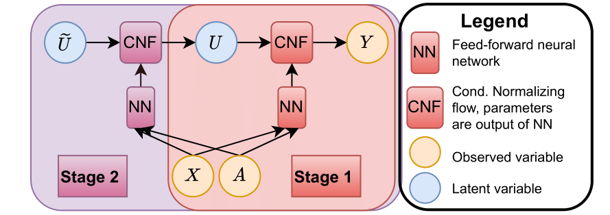

# Neural causal sensitivity analysis

This repository contains the code for our paper "A Neural Framework for Generalized Causal Sensitivity Analysis".

#### Project structure 
- *data* contains the data generation files/ real-world data preprocessing
- *experiments* contains the code to run the experiments and the results, trained models and hyperparameter
- *hyperparam* contains the tuning ranges and code for hyperparameter tuning
- *models* contains code for the sensitivity models, bound computation and estimation, and neural networks

#### Requirements
The project is build with python 3.10 and uses the packages listed in the file `requirements.txt`. 

#### Reproducing the experiments
The scripts running the experiments are contained in the `/experiments` folder. Each experimental setting is contained within its own subfolder. These are:
- `/real_world`: real-world data (Figure 7)
- `/semi_synthetic`: semi-synthetic data (Table 2, Figure 6)
- `/sim_binary_1D`: binary treatment, comparison with CF bounds for MSM (Figure 4, left)
- `/sim_binary_1D_f`: binary treatment, bounds for different sensitivity models (Figure 5, left)
- `/sim_continuous_1D`: continuous treatment, comparison with CF bounds for MSM (Figure 4, right)
- `/sim_continuous_1D_f`: continuous treatment, bounds for different sensitivity models (Figure 5, right)

The file *run.py* executes the experiments. Configuration settings are in *config.yaml*. By default, the pretrained models in the `/saved_models` will be used to estimate bounds. For model training, the parameters *train_propensity*, *train_stage1*, and *train_stage2_all*  in *config.yaml* can be changed to *True*.
